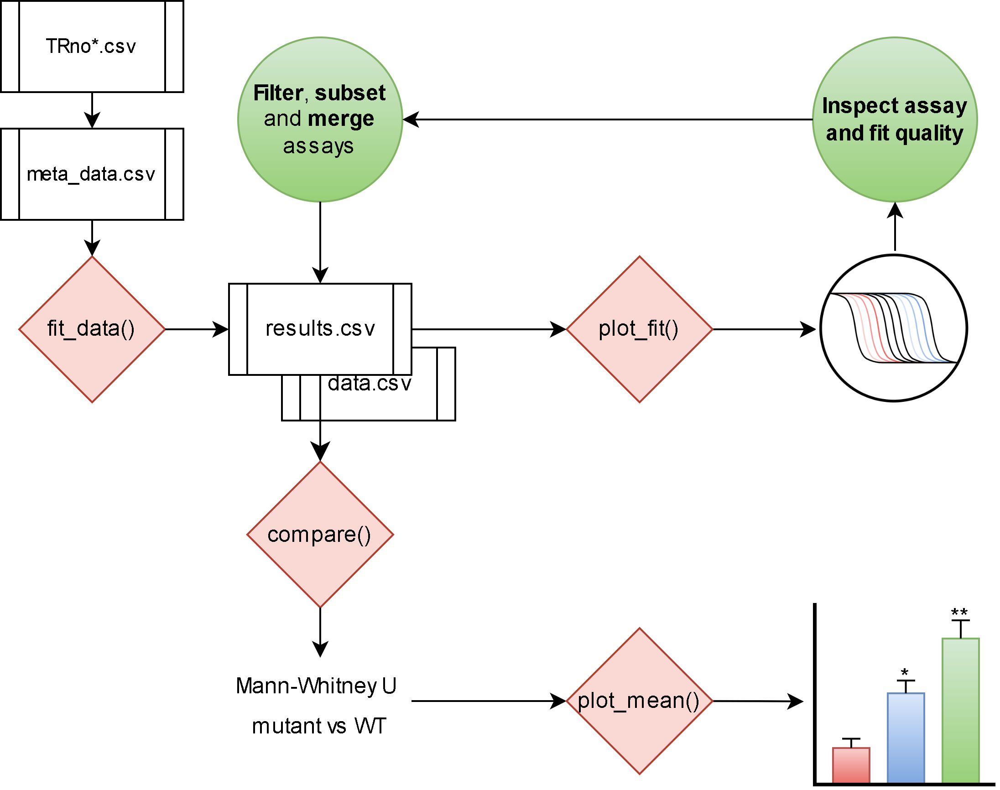

```{r setup, include=FALSE}
knitr::opts_chunk$set(
  collapse = TRUE,
  comment = "#>")
```
 
<a href="https://rayvonw.github.io/batchCurve/"></a>

# batchCurve 

## Overview

batchCurve is an analytical workflow developed for batch analysis of dose-response assays carried on blood stage _Plasmodium falciparum_. It involves the automated fitting of a four parameter log logistic mode to estimate the IC~50~ for a compound-cell combination. Assay formats are assumed to have a 10 point serial dilution as well as a positive and negative growth control. The accepted layouts assume either duplicate or triplicate measurement in either 96 or 384 well culture plates.

A batch of drug assays can be a combination of 96 and/or 384 well plates. It is expected that there will be one raw plate reader csv file per assay plate in the analysis folder. Assays that are on the same plate must have the same number of replicates. More details of the assay setup can be found in `vignette("dose-response-analysis")` and `vignette("plan-assays")`.

## Installation

There is an install_github function in devtools package that allows users to install R packages hosted on GitHub. It requests developer’s name/package name.

```{r , eval = FALSE}
#First install devtools from CRAN
install.packages("devtools")
# load devtools
library(devtools)
# use function to install a github package
install_github("rayVonW/batchCurve")
```
## Usage

The overall process of curve fitting and significance testing is summarised below, where the user applies quality control at certain steps.
<center>
{width=600px}
</center>

You can load the package with:

```{r load}
library(batchCurve)
```

There are four main functions to use:

## 1. Fit model to data: 
[fit_data()] will attempt to fit a four parameter log logistic model to a batch of raw dose-response data.

* This expects as an argument a **meta.csv** file name, this file is to be found in a directory with all raw data file.
* A **prefix** text name - to prefix results files with.
  
```{r, eval = FALSE}
#all meta and raw data stored in ~/batch
d <- fit_data(file_path = '~/batch/meta-data.csv', 
         prefix = 'batch01')
```
`vignette("dose-response-analysis")` gives an expanded introduction to fitting batches of data.

## 2. Visualise the fit:
[plot_fit()] accepts batch log-logistic coefficients and normalised raw data to produce visualisations of dose-response assay data and allow assessment of their fit. 

  * It accepts a data frame of model **results** and a data frame of normalised **data**, both are exported directly from [fit_data()].
  * User can include a prefix for linking visualisation to results in file prefixes.

```{r, eval = FALSE}
#feed results and data for visualisation
plot_fit(results = d[1], 
         data = d[2],
         prefix = 'batch01')
```
`vignette("visualise-models")` gives an expanded introduction to plotting out results.

## 3. Compare IC~50~ data:
Typical use case involves testing a mutants mean IC~50~ vs the wild type. Once you have collected repeated IC~50~ estimates, you can merge the results files into one and feed to [compare()]
    * The function accepts the output results.csv file format of [fit_data()]. 
    * It will calculate mean, standard deviation for each compound-cell combination.
    * It will implement a Mann-Whitney U test for significance of unpaired samples 
    * It will export and return a results csv file of mean IC~50~ values and resulting p values.
    

```{r, eval = FALSE}
comp <-  compare(data = d[1], prefix = 'example')

```
`vignette("compare IC50s")` gives an expanded introduction to significance testing your IC~50~ results.

## 4. Visualise comparisons:

Visualisation has been separated in [plot_mean()] to allow the user to filter comparison results for bar plots of mean IC~50~. 

```{r, eval = FALSE}
# here a pdf called example_IC50_compare.pdf containing barplot in a 2x2 grid
p <- plot_mean(data = comp, prefix = 'example', grid.var = 2)
```
`vignette("compare-IC50s")` gives an expanded introduction to significance testing your IC~50~ results.

## Acknowledgements

* `fit_data()` is a wrapper function for the R package [drc] (https://www.ncbi.nlm.nih.gov/pmc/articles/PMC4696819).
