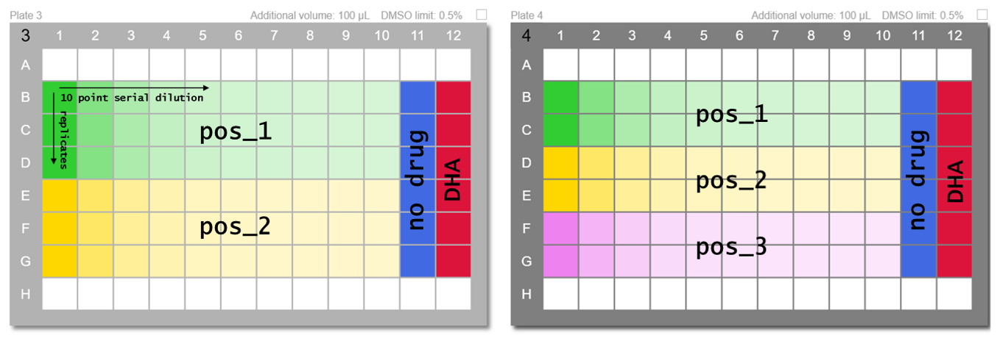
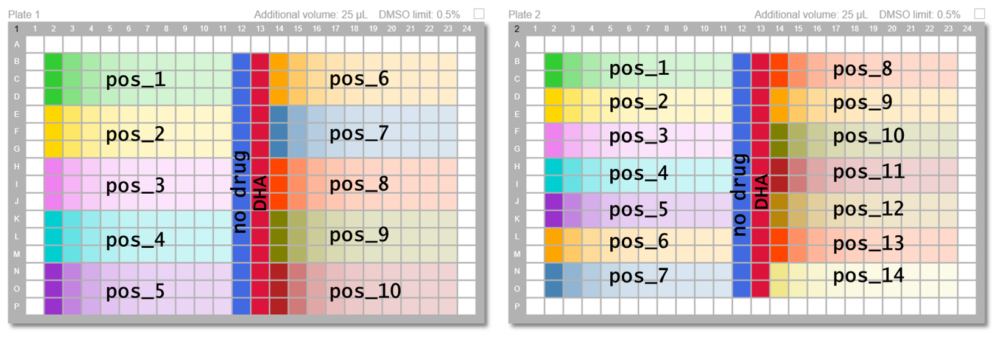

```{r, include = FALSE}
knitr::opts_chunk$set(
  collapse = TRUE,
  comment = "#>",
  message = FALSE, 
  warning = FALSE
)
library(magrittr)
```

```{r setup}
library(batchCurve)
```
This tool 

## Accepted assay format 

Accepted formats include a 10 point serial dilution of 2-3 replicates in either 96 or 384 well plates. The available positions for each format are shown below:

{width=700px}

{width=700px}
batchCurve comes bundled with a number of example dose-response sample files: 

```{r}
batchCurve_example()
```


## Meta data requirments

**Example_meta.csv** contains the meta data that describe the assays and plate contents:

* <span style="color: orange;">**Plate ID**</span> variable to link meta with the plate file of raw measurements
* <span style="color: red;">**Location data**</span> describing the format and positions on the plate each assay sits
* <span style="color: blue;">**Treatment and cell ID**</span> information
* <span style="color: green;">**Dose range**</span> information


```{r example_data}
f <- batchCurve_example("example_meta.csv")
border <- flextable::fp_border_default()
flextable::flextable(head(utils::read.csv(f))) %>%
  flextable::color(j = c("plate_id"), color = "orange", part = "header") %>%
  flextable::color(j = 2:4, color = "red", part = "header") %>%
  flextable::color(j = 5:7, color = "blue", part = "header") %>%
  flextable::color(j = 8:9, color = "green", part = "header") %>%  
  flextable::vline(j = c('plate_id','replicates', 'cell'), 
                   border = border, part = "all") %>% 
  flextable::bold(j = 1:9, bold = TRUE, part = "header")

```


## Raw data format requirements

The analysis pipeline was developed to be compatible with an Omega Fluostar plate reader  csv output (ASCII), which includes 3 required components:

1. Data stored in files with a prefix - 'TRno' or 'automated'.
2. An ID variable set when reading the plate which matches the plate_id in the meta file (Omega prefixes with 'ID1:').
3. Raw read data in plate format where well A01 begins in cell [1,11] of the file.


```{r}
f <- batchCurve_example("TRno3735.CSV")
utils::read.csv(f, nrow = 2)
```
 
```{r}
head(utils::read.csv(f, skip = 10),11)
```

