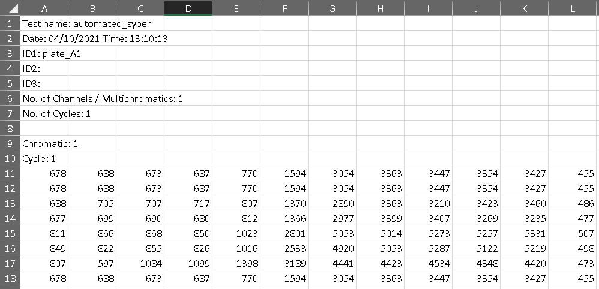

```{r, include = FALSE}
knitr::opts_chunk$set(
  collapse = TRUE,
  comment = "#>",
  message = FALSE, 
  warning = FALSE
)
```

```{r setup}
library(gamma)
```
This tool 

## Accepted format 

Accepted formats include a 10 point serial dilution of 2-3 replicates in either 96 or 384 well plates. The available positions for each format are shown below:

{width=500px}

{width=500px}

## Meta data requirments

Meta data describes the plate contents:
* Plate ID variable to link meta with the plate file of raw measurements
* Location data describing the format and positions on the plate each assay sits
* Treatment and cell ID information
* Dose range information

```{r}
head(example_meta)
```
## Raw data format requirements

The analysis pipeline was developed to be compatible with an Omega Fluostar plate reader  csv output (ASCII), which includes 3 required components:

1. Data stored in files with a prefix - 'TRno' or 'automated'.
2. An ID variable set when reading the plate which matches the plate_id in the meta file (Omega prefixes with 'ID1:').
3. Raw read data in plate format where well A01 begins in cell [1,11] of the file.

{width=500px}
